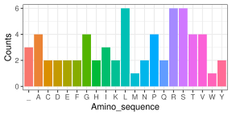
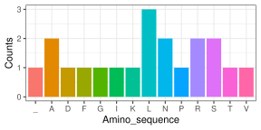

**GitHub repository:** <https://github.com/rforbiodatascience25/group30>

## Introduction

The group 30 package provides a set of functions that allow users to
generate random DNA sequences, convert DNA to RNA, identify codons,
translate codons into amino acids, and visualize amino acid composition
as a histogram.

### 1. Creating a DNA Sequence

The `create_dna_sequence()` function randomly generates a DNA sequence
of the desired length.

    #> [1] "TGTCGGTGCGGCGTGACCTTTCAAAAGTTC"

### 2. Transcribing DNA to RNA

`dna_to_rna()` converts a DNA sequence to an RNA sequence by replacing
all thymine (T) bases with uracil (U).

    #> [1] "UGUCGGUGCGGCGUGACCUUUCAAAAGUUC"

### 3. Finding Codons

The `find_codons()` function breaks a DNA or RNA sequence into triplets
(codons). These codons represent the smallest meaningful units in
translation.

    #> [1] "UGU" "CGG" "UGC" "GGC" "GUG" "ACC"

### 4. Translating Codons to Amino Acids

The `AASeq()` function converts codons into their corresponding amino
acids, using a standard codon table (`standard_codon`).

    #> [1] "FSYCFSYCLS__LS_WLPHRLPHRLPQRLPQRITNSITNSITKRMTKRVADGVADGVAEGVAEG"

### 5. Visualizing Amino Acid Composition

The `amino_histogram()` function generates a histogram of amino acid
frequencies in the translated sequence.



### Combining Functions: A Full Workflow

All functions can be used together to simulate the entire
gene-to-protein process:

``` r
full_dna <- create_dna_sequence(60)
full_rna <- dna_to_rna(full_dna)
full_codons <- find_codons(full_rna)
full_amino <- AASeq(full_codons)
amino_histogram(full_amino)
```



## Discussion and Use Cases

### Handling Dependencies

For function 5 (`amino_histogram`), we needed to use the packages
stringr and ggplot2. We added them as dependencies by:

1.  Using `@importFrom stringr str_split boundary str_count` in the
    function’s documentation so that only the specific functions we need
    are imported.
2.  Using ggplot2 directly for the plotting commands in the function
    body.

This approach ensures that our package does not load entire packages
unnecessarily, which reduces namespace conflicts and keeps installation
lightweight.

### Limiting Dependencies

It’s generally a good idea to minimize the number of dependencies your
package uses because each additional dependency increases the chance of
installation failures, dependencies can bring in their own bugs or
breaking changes in future versions, and fewer dependencies make your
package more portable and easier to maintain.

However, some dependencies are unavoidable if your package needs
specialized functionality (e.g., ggplot2 for plotting, dplyr for data
manipulation). In those cases, careful selection and documenting them in
DESCRIPTION is important.

### **`@importFrom` vs `package::function()`**

@importFrom`package function` in the Roxygen documentation, imports only
the specified functions when building the namespace. This is more
lightweight and avoids loading the entire package unnecessarily.
`package::function()` calls a function directly without importing it,
which works anywhere, but does not automatically make it available for
other functions in your package. We used a combination of both
approaches to balance efficiency, clarity, and namespace management.

### Use cases

This package models the central dogma of molecular biology: DNA -\> RNA
-\> Protein, in a simple and reproducible way. It can be used in
bioinformatics education to demonstrate sequence translation or
simulation experiments to test codon bias or amino acid composition.

### Possible extensions

Future versions of the package could include functions for the reverse
translation, protein into DNA. In addition, there could also be added
mutation simulation tools to introduce point mutations.
